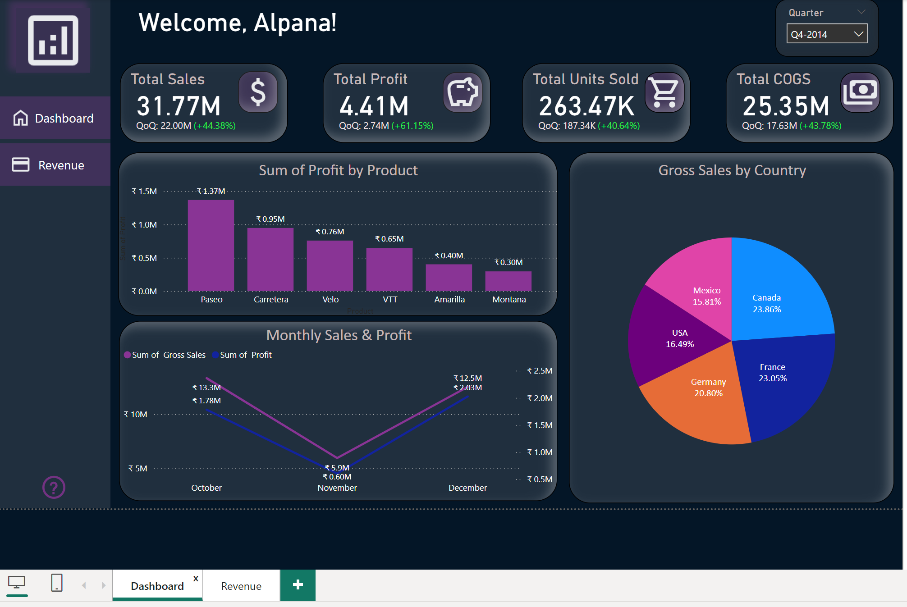
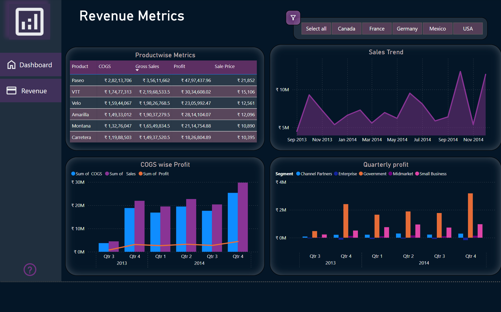

# Revenue-Metrics-Dashboard

## Overview
This project provides an interactive Power BI dashboard to visualize key metrics related to revenue, profitability, and sales trends.

## Features
- Interactive filters for regions (Canada, France, Germany, Mexico, USA).
- Detailed metrics like COGS, Gross Sales, and Profit.
- Visualizations for:
  - Product-wise metrics
  - Quarterly profit trends
  - Country-wise sales distribution

## Tools & Technologies
- **Power BI**: For creating the dashboard and visualizations.
- **DAX**: For data modeling and calculations.